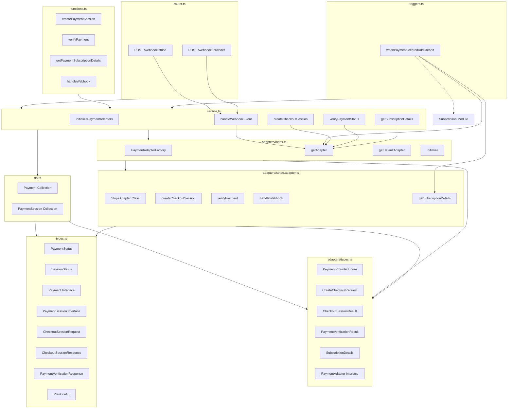
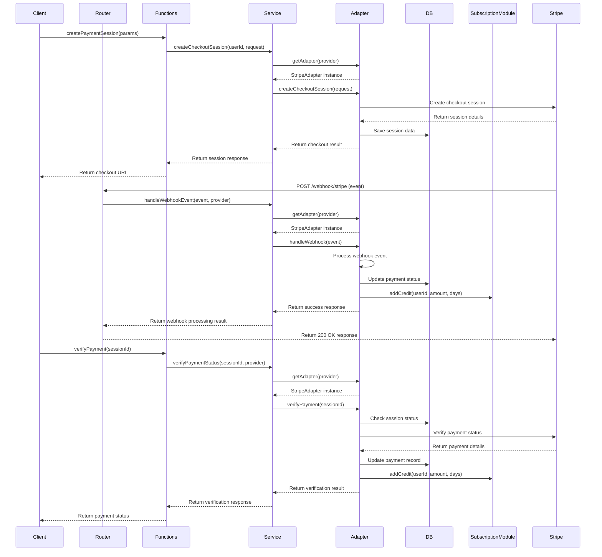
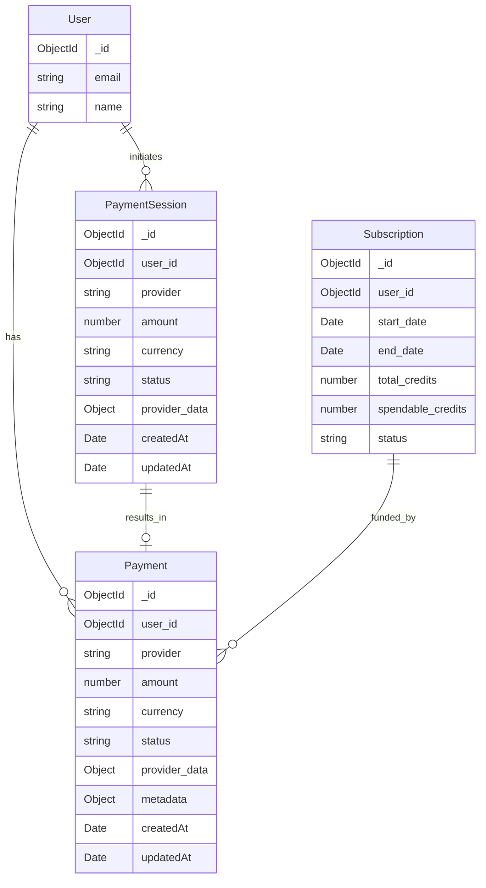
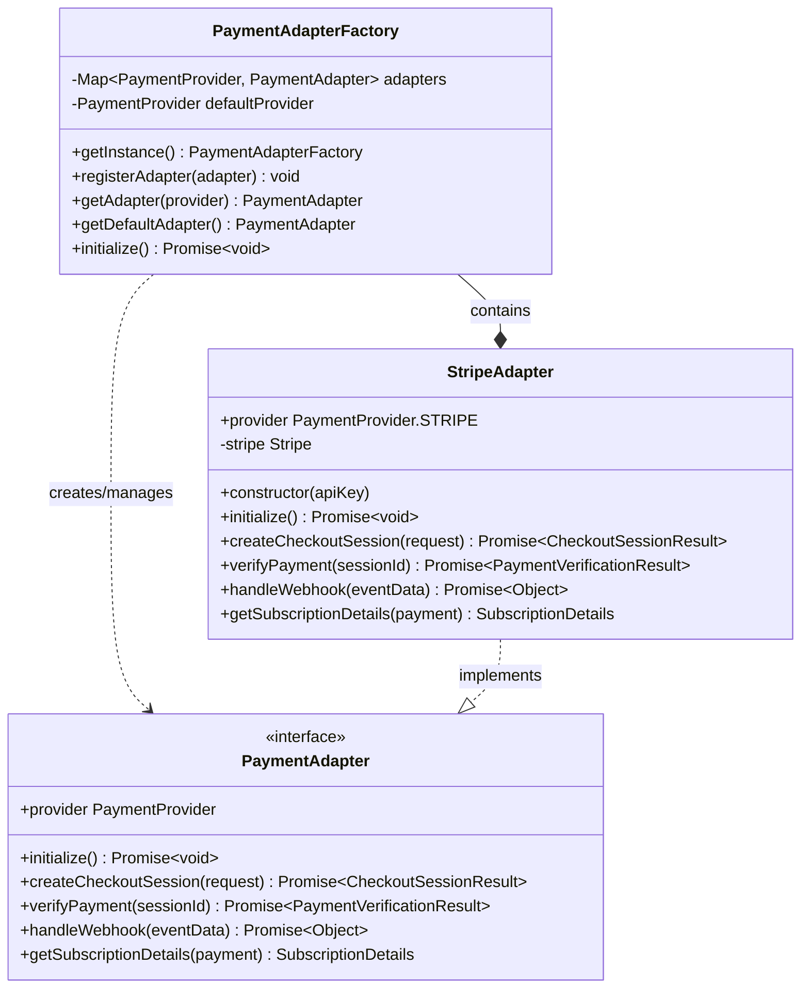
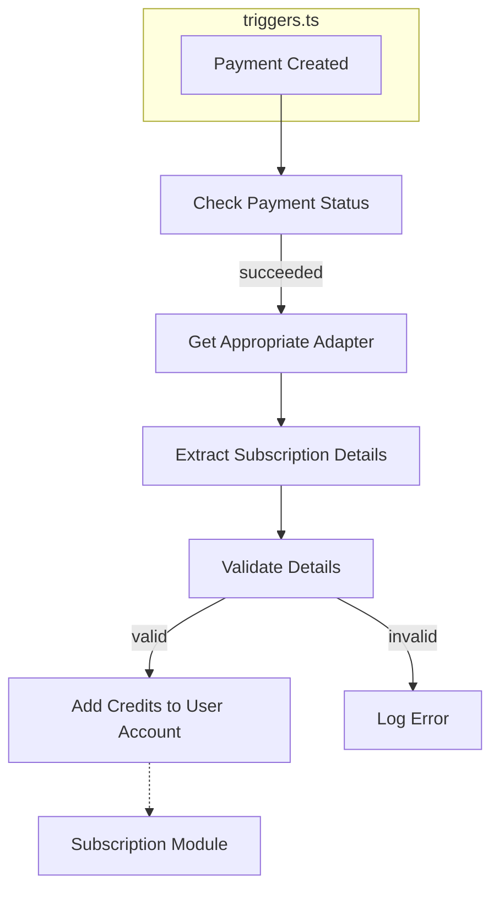

# Gateway Module Architecture

## Module Structure Diagram

```mermaid
graph TD
    %% Main files
    Router[router.ts]
    Service[service.ts]
    DB[db.ts]
    Functions[functions.ts]
    Types[types.ts]
    Triggers[triggers.ts]
    
    %% Adapter files
    AdaptersIndex[adapters/index.ts]
    AdaptersTypes[adapters/types.ts]
    StripeAdapter[adapters/stripe.adapter.ts]
    
    %% Interfaces and Types
    subgraph Types[types.ts]
        PaymentStatus[PaymentStatus]
        SessionStatus[SessionStatus]
        Payment[Payment Interface]
        PaymentSession[PaymentSession Interface]
        CheckoutSessionRequest[CheckoutSessionRequest]
        CheckoutSessionResponse[CheckoutSessionResponse]
        PaymentVerificationResponse[PaymentVerificationResponse]
        PlanConfig[PlanConfig]
    end
    
    subgraph AdaptersTypes[adapters/types.ts]
        PaymentProvider[PaymentProvider Enum]
        CreateCheckoutRequest[CreateCheckoutRequest]
        CheckoutSessionResult[CheckoutSessionResult]
        PaymentVerificationResult[PaymentVerificationResult]
        SubscriptionDetails[SubscriptionDetails]
        PaymentAdapter[PaymentAdapter Interface]
    end
    
    %% Database Collections
    subgraph DB[db.ts]
        PaymentCollection[Payment Collection]
        PaymentSessionCollection[PaymentSession Collection]
    end
    
    %% Triggers
    subgraph Triggers[triggers.ts]
        WhenPaymentCreatedAddCredit[whenPaymentCreatedAddCreadit]
    end
    
    %% Service functions
    subgraph Service[service.ts]
        InitializePaymentAdapters[initializePaymentAdapters]
        CreateCheckoutSession[createCheckoutSession]
        VerifyPaymentStatus[verifyPaymentStatus]
        HandleWebhookEvent[handleWebhookEvent]
        GetSubscriptionDetails[getSubscriptionDetails]
    end
    
    %% Functions
    subgraph Functions[functions.ts]
        CreatePaymentSession[createPaymentSession]
        VerifyPayment[verifyPayment]
        GetPaymentSubscriptionDetails[getPaymentSubscriptionDetails]
        HandleWebhook[handleWebhook]
    end
    
    %% Router
    subgraph Router[router.ts]
        StripeWebhookEndpoint[POST /webhook/stripe]
        GenericWebhookEndpoint[POST /webhook/:provider]
    end
    
    %% Adapters
    subgraph AdaptersIndex[adapters/index.ts]
        PaymentAdapterFactory[PaymentAdapterFactory]
        GetAdapterMethod[getAdapter]
        GetDefaultAdapterMethod[getDefaultAdapter]
        InitializeMethod[initialize]
    end
    
    subgraph StripeAdapter[adapters/stripe.adapter.ts]
        StripeAdapterClass[StripeAdapter Class]
        StripeCreateCheckoutSession[createCheckoutSession]
        StripeVerifyPayment[verifyPayment]
        StripeHandleWebhook[handleWebhook]
        StripeGetSubscriptionDetails[getSubscriptionDetails]
    end
    
    %% Relationships
    Router --> Service
    Service --> AdaptersIndex
    Service --> DB
    Functions --> Service
    Triggers --> Service
    
    DB --> AdaptersTypes
    DB --> Types
    
    AdaptersIndex --> AdaptersTypes
    AdaptersIndex --> StripeAdapter
    
    StripeAdapter --> AdaptersTypes
    StripeAdapter --> Types
    
    %% Function relationships
    StripeWebhookEndpoint --> HandleWebhookEvent
    GenericWebhookEndpoint --> HandleWebhookEvent
    HandleWebhookEvent --> GetAdapterMethod
    
    %% Trigger relationships
    WhenPaymentCreatedAddCredit --> GetAdapterMethod
    WhenPaymentCreatedAddCredit --> StripeGetSubscriptionDetails
    
    %% Service to Adapter relationships
    CreateCheckoutSession --> GetAdapterMethod
    VerifyPaymentStatus --> GetAdapterMethod
    GetSubscriptionDetails --> GetAdapterMethod
    
    %% External module connections
    WhenPaymentCreatedAddCredit -.-> SubscriptionModule[Subscription Module]
```

## Data Flow Diagram

```mermaid
sequenceDiagram
    participant Client
    participant Router
    participant Functions
    participant Service
    participant Adapter
    participant DB
    participant SubscriptionModule
    
    %% Checkout Session Flow
    Client->>Functions: createPaymentSession(params)
    Functions->>Service: createCheckoutSession(userId, request)
    Service->>Adapter: getAdapter(provider)
    Adapter-->>Service: StripeAdapter instance
    Service->>Adapter: createCheckoutSession(request)
    Adapter->>Stripe: Create checkout session
    Stripe-->>Adapter: Return session details
    Adapter->>DB: Save session data
    Adapter-->>Service: Return checkout result
    Service-->>Functions: Return session response
    Functions-->>Client: Return checkout URL
    
    %% Webhook Flow
    Stripe->>Router: POST /webhook/stripe (event)
    Router->>Service: handleWebhookEvent(event, provider)
    Service->>Adapter: getAdapter(provider)
    Adapter-->>Service: StripeAdapter instance
    Service->>Adapter: handleWebhook(event)
    Adapter->>Adapter: Process webhook event
    Adapter->>DB: Update payment status
    Adapter->>SubscriptionModule: addCredit(userId, amount, days)
    Adapter-->>Service: Return success response
    Service-->>Router: Return webhook processing result
    Router-->>Stripe: Return 200 OK response
    
    %% Payment Verification Flow
    Client->>Functions: verifyPayment(sessionId)
    Functions->>Service: verifyPaymentStatus(sessionId, provider)
    Service->>Adapter: getAdapter(provider)
    Adapter-->>Service: StripeAdapter instance
    Service->>Adapter: verifyPayment(sessionId)
    Adapter->>DB: Check session status
    Adapter->>Stripe: Verify payment status
    Stripe-->>Adapter: Return payment details
    Adapter->>DB: Update payment record
    Adapter->>SubscriptionModule: addCredit(userId, amount, days)
    Adapter-->>Service: Return verification result
    Service-->>Functions: Return verification response
    Functions-->>Client: Return payment status
```

## Entity Relationship Diagram

```mermaid
erDiagram
    User ||--o{ PaymentSession : initiates
    User ||--o{ Payment : has
    PaymentSession ||--o| Payment : results_in
    
    User {
        ObjectId _id
        string email
        string name
    }
    
    PaymentSession {
        ObjectId _id
        ObjectId user_id
        string provider
        number amount
        string currency
        string status
        Object provider_data
        Date createdAt
        Date updatedAt
    }
    
    Payment {
        ObjectId _id
        ObjectId user_id
        string provider
        number amount
        string currency
        string status
        Object provider_data
        Object metadata
        Date createdAt
        Date updatedAt
    }
    
    Subscription ||--o{ Payment : funded_by
    
    Subscription {
        ObjectId _id
        ObjectId user_id
        Date start_date
        Date end_date
        number total_credits
        number spendable_credits
        string status
    }
```

## Adapter Factory Pattern

```mermaid
classDiagram
    class PaymentAdapterFactory {
        -Map~PaymentProvider, PaymentAdapter~ adapters
        -PaymentProvider defaultProvider
        +getInstance() PaymentAdapterFactory
        +registerAdapter(adapter) void
        +getAdapter(provider) PaymentAdapter
        +getDefaultAdapter() PaymentAdapter
        +initialize() Promise~void~
    }
    
    class PaymentAdapter {
        <<interface>>
        +provider PaymentProvider
        +initialize() Promise~void~
        +createCheckoutSession(request) Promise~CheckoutSessionResult~
        +verifyPayment(sessionId) Promise~PaymentVerificationResult~
        +handleWebhook(eventData) Promise~Object~
        +getSubscriptionDetails(payment) SubscriptionDetails
    }
    
    class StripeAdapter {
        +provider PaymentProvider.STRIPE
        -stripe Stripe
        +constructor(apiKey)
        +initialize() Promise~void~
        +createCheckoutSession(request) Promise~CheckoutSessionResult~
        +verifyPayment(sessionId) Promise~PaymentVerificationResult~
        +handleWebhook(eventData) Promise~Object~
        +getSubscriptionDetails(payment) SubscriptionDetails
    }
    
    PaymentAdapterFactory ..> PaymentAdapter : creates/manages
    StripeAdapter ..|> PaymentAdapter : implements
    PaymentAdapterFactory --* StripeAdapter : contains
```

## Trigger Flow Diagram

```mermaid
flowchart TD
    %% Triggers
    subgraph Triggers[triggers.ts]
        PaymentCreated[Payment Created]
    end
    
    %% Flow
    PaymentCreated --> CheckPaymentStatus[Check Payment Status]
    CheckPaymentStatus -->|succeeded| GetAdapter[Get Appropriate Adapter]
    GetAdapter --> ExtractSubscriptionDetails[Extract Subscription Details]
    ExtractSubscriptionDetails --> ValidateDetails[Validate Details]
    ValidateDetails -->|valid| AddCredits[Add Credits to User Account]
    ValidateDetails -->|invalid| LogError[Log Error]
    
    %% External connections
    AddCredits -.-> SubscriptionModule[Subscription Module]
``` 