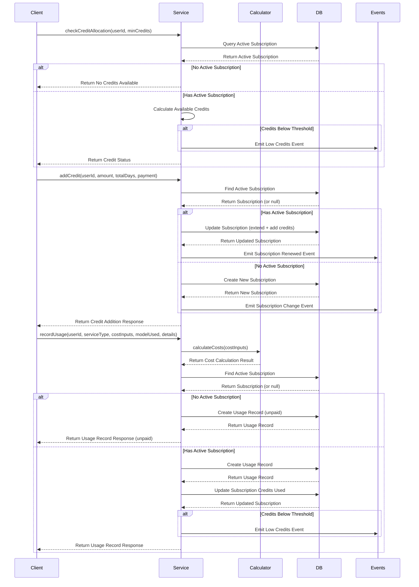
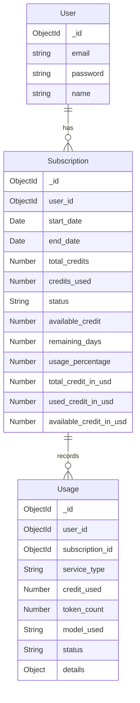
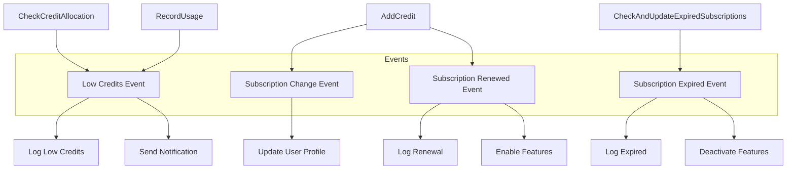

# Subscription Module Architecture

## Module Structure Diagram

```mermaid
graph TD
    %% Main files
    Service[service.ts]
    DB[db.ts]
    Events[events.ts]
    Types[types.ts]
    Functions[functions.ts]
    Calculator[calculator.ts]
    Config[config.ts]
    
    %% Interfaces and Types
    subgraph Types[types.ts]
        SubscriptionInterface[Subscription Interface]
        UsageInterface[Usage Interface]
        PaymentDetailsInterface[PaymentDetails Interface]
        CreditStatusResponse[CreditStatusResponse]
        CreditAdditionResponse[CreditAdditionResponse]
        UsageRecordResponse[UsageRecordResponse]
    end
    
    %% Database Collections
    subgraph DB[db.ts]
        SubscriptionCollection[Subscription Collection]
        UsageCollection[Usage Collection]
        VirtualProperties[Subscription Virtual Properties]
    end
    
    %% Events
    subgraph Events[events.ts]
        EventEmitter[subscriptionEvents]
        LowCreditsEvent[emitLowCreditsEvent]
        SubscriptionChangeEvent[emitSubscriptionChangeEvent]
        SubscriptionExpiredEvent[emitSubscriptionExpiredEvent]
        SubscriptionRenewedEvent[emitSubscriptionRenewedEvent]
    end
    
    %% Calculator
    subgraph Calculator[calculator.ts]
        CalculatorService[CalculatorService]
        CalculateCosts[calculateCosts]
        CreditsToUsd[creditsToUsd]
        UsdToCredits[usdToCredits]
        CostCalculationInput[CostCalculationInput Interface]
        CostCalculationResult[CostCalculationResult Interface]
    end
    
    %% Config
    subgraph Config[config.ts]
        CostTranspose[COST_TRANSPOSE]
        TokenMUnit[TOKEN_M_UNIT]
        LowCreditsThreshold[LOW_CREDITS_THRESHOLD]
    end
    
    %% Service functions
    subgraph Service[service.ts]
        CheckCreditAllocation[checkCreditAllocation]
        AddCredit[addCredit]
        CheckAndUpdateExpiredSubscriptions[checkAndUpdateExpiredSubscriptions]
        RecordUsage[recordUsage]
    end
    
    %% Functions exporter
    subgraph Functions[functions.ts]
        GetSubscriptionDetails[getSubscriptionDetails]
    end
    
    %% Relationships
    Service --> DB
    Service --> Events
    Service --> Types
    Service --> Calculator
    Service --> Config
    Functions --> DB
    Functions --> Types
    Calculator --> Config
    DB --> Calculator
    
    %% Specific relationships
    CheckCreditAllocation --> LowCreditsEvent
    AddCredit --> SubscriptionChangeEvent
    AddCredit --> SubscriptionRenewedEvent
    CheckAndUpdateExpiredSubscriptions --> SubscriptionExpiredEvent
    RecordUsage --> CalculateCosts
    RecordUsage --> LowCreditsEvent
    VirtualProperties --> CreditsToUsd
    
    %% Database Relationships
    SubscriptionCollection -.-> SubscriptionInterface
    UsageCollection -.-> UsageInterface
```



## Data Flow Diagram



## Entity Relationship Diagram



## Event Flow Diagram



## Calculator Service Flow

```mermaid
flowchart TD
    %% Calculator Service
    subgraph CalculatorService
        CalculateCosts[calculateCosts]
        CreditsToUsd[creditsToUsd]
        UsdToCredits[usdToCredits]
    end
    
    %% Input/Output
    CostInputs[CostCalculationInput[]] --> CalculateCosts
    CalculateCosts --> CostResult[CostCalculationResult]
    
    %% Calculation Steps
    subgraph CostCalculation
        ForEachItem[Process Each Input Item]
        CalculateUsd[Calculate USD Cost]
        CalculateCredits[Calculate Credit Cost]
        AggregateTotals[Aggregate Totals]
    end
    
    CalculateCosts --> ForEachItem
    ForEachItem --> CalculateUsd
    CalculateUsd --> CalculateCredits
    CalculateCredits --> AggregateTotals
    AggregateTotals --> CostResult
    
    %% Conversion Utilities
    Credits[Credits Amount] --> CreditsToUsd
    CreditsToUsd --> UsdAmount[USD Amount]
    
    UsdValue[USD Value] --> UsdToCredits
    UsdToCredits --> CreditsValue[Credits Value]
    
    %% Config Dependencies
    Config[Configuration Constants] -.-> CalculateCredits
    Config -.-> CreditsToUsd
    Config -.-> UsdToCredits
``` 