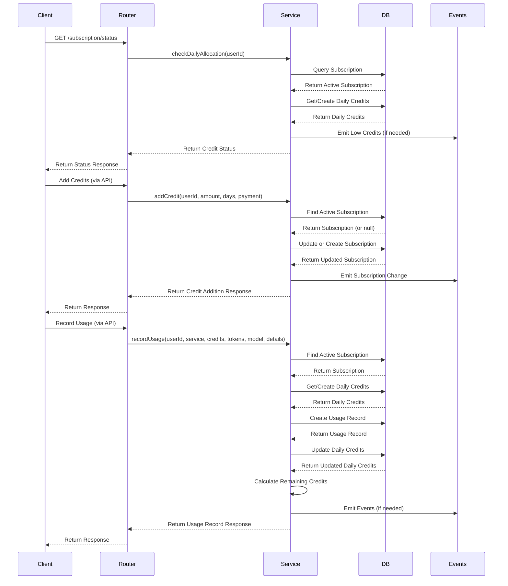
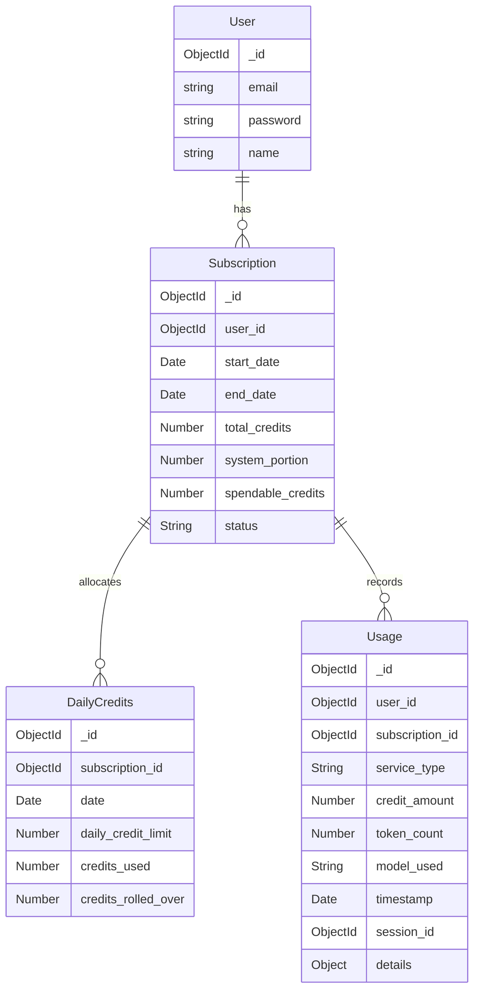
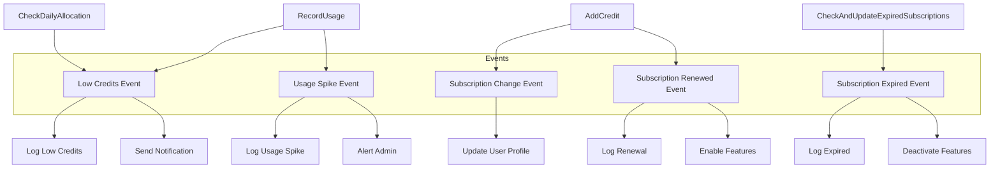

# Subscription Module Architecture

## Module Structure Diagram

```mermaid
graph TD
    %% Main files
    Router[router.ts]
    Service[service.ts]
    DB[db.ts]
    Events[events.ts]
    Types[types.ts]
    Functions[functions/index.ts]
    
    %% Interfaces and Types
    subgraph Types[types.ts]
        SubscriptionInterface[Subscription Interface]
        DailyCreditsInterface[DailyCredits Interface]
        UsageInterface[Usage Interface]
        PaymentDetailsInterface[PaymentDetails Interface]
        CreditStatusResponse[CreditStatusResponse]
        CreditAdditionResponse[CreditAdditionResponse]
        UsageRecordResponse[UsageRecordResponse]
    end
    
    %% Database Collections
    subgraph DB[db.ts]
        SubscriptionCollection[Subscription Collection]
        DailyCreditsCollection[DailyCredits Collection]
        UsageCollection[Usage Collection]
    end
    
    %% Events
    subgraph Events[events.ts]
        EventEmitter[subscriptionEvents]
        LowCreditsEvent[emitLowCreditsEvent]
        SubscriptionChangeEvent[emitSubscriptionChangeEvent]
        UsageSpikeEvent[emitUsageSpikeEvent]
        SubscriptionExpiredEvent[emitSubscriptionExpiredEvent]
        SubscriptionRenewedEvent[emitSubscriptionRenewedEvent]
    end
    
    %% Service functions
    subgraph Service[service.ts]
        GetOrCreateDailyCredits[getOrCreateDailyCredits]
        CheckDailyAllocation[checkDailyAllocation]
        AddCredit[addCredit]
        CheckAndUpdateExpiredSubscriptions[checkAndUpdateExpiredSubscriptions]
        RecordUsage[recordUsage]
        GetMonthlyUsage[getMonthlyUsage]
    end
    
    %% Router
    subgraph Router[router.ts]
        StatusEndpoint[GET /subscription/status]
    end
    
    %% Functions exporter
    subgraph Functions[functions/index.ts]
        ExportedFunctions[Exported Service Functions]
    end
    
    %% Relationships
    Router --> Service
    Service --> DB
    Service --> Events
    Service --> Types
    Functions --> Service
    
    %% Specific relationships
    StatusEndpoint --> CheckDailyAllocation
    CheckDailyAllocation --> GetOrCreateDailyCredits
    CheckDailyAllocation --> LowCreditsEvent
    AddCredit --> GetOrCreateDailyCredits
    AddCredit --> SubscriptionChangeEvent
    AddCredit --> SubscriptionRenewedEvent
    CheckAndUpdateExpiredSubscriptions --> SubscriptionExpiredEvent
    RecordUsage --> GetOrCreateDailyCredits
    RecordUsage --> LowCreditsEvent
    RecordUsage --> UsageSpikeEvent
    RecordUsage --> GetMonthlyUsage
    
    %% Database Relationships
    SubscriptionCollection -.-> SubscriptionInterface
    DailyCreditsCollection -.-> DailyCreditsInterface
    UsageCollection -.-> UsageInterface
```

## Data Flow Diagram

```mermaid
sequenceDiagram
    participant Client
    participant Router
    participant Service
    participant DB
    participant Events
    
    %% Status Check Flow
    Client->>Router: GET /subscription/status
    Router->>Service: checkDailyAllocation(userId)
    Service->>DB: Query Subscription
    DB-->>Service: Return Active Subscription
    Service->>DB: Get/Create Daily Credits
    DB-->>Service: Return Daily Credits
    Service->>Events: Emit Low Credits (if needed)
    Service-->>Router: Return Credit Status
    Router-->>Client: Return Status Response
    
    %% Adding Credits Flow
    Client->>Router: Add Credits (via API)
    Router->>Service: addCredit(userId, amount, days, payment)
    Service->>DB: Find Active Subscription
    DB-->>Service: Return Subscription (or null)
    Service->>DB: Update or Create Subscription
    DB-->>Service: Return Updated Subscription
    Service->>Events: Emit Subscription Change
    Service-->>Router: Return Credit Addition Response
    Router-->>Client: Return Response
    
    %% Usage Recording Flow
    Client->>Router: Record Usage (via API)
    Router->>Service: recordUsage(userId, service, credits, tokens, model, details)
    Service->>DB: Find Active Subscription
    DB-->>Service: Return Subscription
    Service->>DB: Get/Create Daily Credits
    DB-->>Service: Return Daily Credits
    Service->>DB: Create Usage Record
    DB-->>Service: Return Usage Record
    Service->>DB: Update Daily Credits
    DB-->>Service: Return Updated Daily Credits
    Service->>Service: Calculate Remaining Credits
    Service->>Events: Emit Events (if needed)
    Service-->>Router: Return Usage Record Response
    Router-->>Client: Return Response
```

## Entity Relationship Diagram

```mermaid
erDiagram
    User ||--o{ Subscription : has
    Subscription ||--o{ DailyCredits : allocates
    Subscription ||--o{ Usage : records
    
    User {
        ObjectId _id
        string email
        string password
        string name
    }
    
    Subscription {
        ObjectId _id
        ObjectId user_id
        Date start_date
        Date end_date
        Number total_credits
        Number system_portion
        Number spendable_credits
        String status
    }
    
    DailyCredits {
        ObjectId _id
        ObjectId subscription_id
        Date date
        Number daily_credit_limit
        Number credits_used
        Number credits_rolled_over
    }
    
    Usage {
        ObjectId _id
        ObjectId user_id
        ObjectId subscription_id
        String service_type
        Number credit_amount
        Number token_count
        String model_used
        Date timestamp
        ObjectId session_id
        Object details
    }
```

## Event Flow Diagram

```mermaid
flowchart TD
    %% Events
    subgraph Events
        A[Low Credits Event]
        B[Subscription Change Event]
        C[Usage Spike Event]
        D[Subscription Expired Event]
        E[Subscription Renewed Event]
    end
    
    %% Triggers
    CheckDailyAllocation --> A
    RecordUsage --> A
    RecordUsage --> C
    AddCredit --> B
    AddCredit --> E
    CheckAndUpdateExpiredSubscriptions --> D
    
    %% Handlers
    A --> LogLowCredits[Log Low Credits]
    A --> SendNotification[Send Notification]
    B --> UpdateUserProfile[Update User Profile]
    C --> LogUsageSpike[Log Usage Spike]
    C --> AlertAdmin[Alert Admin]
    D --> LogExpired[Log Expired]
    D --> DeactivateFeatures[Deactivate Features]
    E --> LogRenewal[Log Renewal]
    E --> EnableFeatures[Enable Features]
``` 